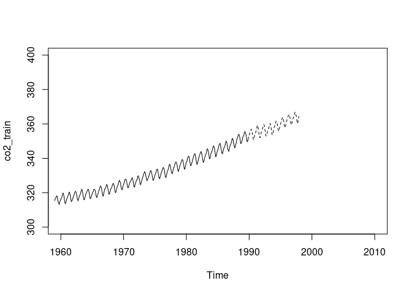
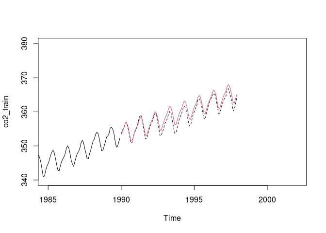
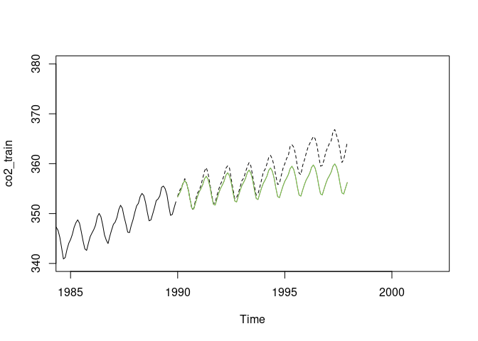
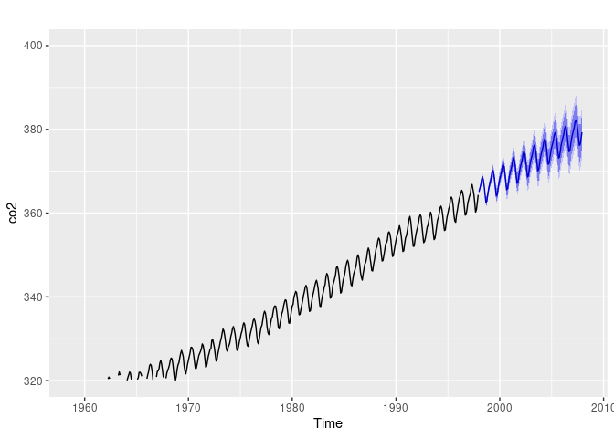

TS - O2 Forecast
================
Benjamin BERNARD
28/10/2021

1.  **Dataset splitting**

The test subset must have the size of the data we want to forecast. Here
we want to predict the next 7 years so we keep only the last 7 years for
the train subset.

``` r
co2_train=window(co2,start=c(1959,1),end=c(1989,12))
co2_test=window(co2,start=c(1990,1),end=c(1997,12))
```

We can plot both subset.

``` r
plot(co2_train,xlim=c(1960,2010),ylim=c(300,400))
lines(co2_test,lty=2)
```

<!-- -->

2.  **Visual Analyse**

We can see on the above plot that we have the following characteristics
:

-   A seasonality (values looks to have the same behavior over the
    time - increasing and decreasing)

-   A trend (values grows along the dataset)

3.  **Forecasting**

Data looks quite easy to forecast. Let’s try with the HoltWinters
forecasting method.

To create the model, we use hx() function with the following parameters
:

-   dataset to use (here for this step we will use co2\_train as it’s
    our training model)

-   seasonal=‘additive’ as the trend is increasing proportionally. We
    could use ‘multiplicative’ in case of an exponential trend.

-   h is the number of values to forecast after the dataset we choose.
    96 here is the amount of values in the test set.

Then we’ll plot the whole dataset (co2\_train in plain line, and
co2\_test in dotted line) plus the forecast to visualise the quality of
our forecast.

``` r
#install.packages("forecast")
library(forecast)
```

    ## Registered S3 method overwritten by 'quantmod':
    ##   method            from
    ##   as.zoo.data.frame zoo

``` r
h=hw(co2_train,seasonal='additive',h=96)
plot(co2_train,xlim=c(1985,2002),ylim=c(340,380))
lines(co2_test,lty=2)
lines(h$mean,col=2)
```

<!-- -->

``` r
accuracy(h)
```

    ##                       ME      RMSE       MAE         MPE       MAPE      MASE
    ## Training set 0.008479436 0.2759248 0.2215104 0.002338203 0.06697299 0.1793526
    ##                    ACF1
    ## Training set 0.09776747

We may try to use a Damped version :

``` r
hd=hw(co2_train,seasonal='additive',damped=TRUE,h=96)
plot(co2_train,xlim=c(1985,2002),ylim=c(340,380))
lines(co2_test,lty=2)
lines(hd$mean,col=2)
lines(hd$mean,col=3)
```

<!-- -->

``` r
print(sqrt(mean((hd$mean-co2_test)^2)))
```

    ## [1] 3.686467

We can see that it’s worse… So we will use our first model which
forecast reasonably our dataset. Let’s forecast 10 years.

``` r
h=hw(co2,seasonal='additive',damped=FALSE,h=120)
autoplot(co2,xlim=c(1985,2011),ylim=c(320,400))+autolayer(h)
```

    ## Warning: Ignoring unknown parameters: xlim, ylim

    ## Scale for 'x' is already present. Adding another scale for 'x', which will
    ## replace the existing scale.

<!-- -->

``` r
h
```

    ##          Point Forecast    Lo 80    Hi 80    Lo 95    Hi 95
    ## Jan 1998       365.1453 364.7685 365.5221 364.5691 365.7215
    ## Feb 1998       365.9574 365.5209 366.3938 365.2899 366.6248
    ## Mar 1998       366.7742 366.2843 367.2641 366.0250 367.5234
    ## Apr 1998       368.1225 367.5834 368.6615 367.2981 368.9469
    ## May 1998       368.6416 368.0566 369.2265 367.7469 369.5362
    ## Jun 1998       367.9198 367.2914 368.5482 366.9587 368.8808
    ## Jul 1998       366.4165 365.7467 367.0863 365.3922 367.4409
    ## Aug 1998       364.3483 363.6388 365.0579 363.2632 365.4335
    ## Sep 1998       362.5671 361.8192 363.3149 361.4232 363.7109
    ## Oct 1998       362.8147 362.0296 363.5997 361.6140 364.0153
    ## Nov 1998       364.2734 363.4521 365.0946 363.0174 365.5294
    ## Dec 1998       365.6727 364.8161 366.5293 364.3627 366.9827
    ## Jan 1999       366.6571 365.7503 367.5638 365.2703 368.0438
    ## Feb 1999       367.4691 366.5291 368.4092 366.0314 368.9068
    ## Mar 1999       368.2860 367.3132 369.2588 366.7982 369.7738
    ## Apr 1999       369.6343 368.6292 370.6394 368.0971 371.1714
    ## May 1999       370.1533 369.1164 371.1903 368.5675 371.7392
    ## Jun 1999       369.4316 368.3632 370.4999 367.7976 371.0655
    ## Jul 1999       367.9283 366.8288 369.0278 366.2468 369.6098
    ## Aug 1999       365.8601 364.7299 366.9903 364.1316 367.5887
    ## Sep 1999       364.0788 362.9181 365.2395 362.3037 365.8540
    ## Oct 1999       364.3264 363.1355 365.5174 362.5051 366.1478
    ## Nov 1999       365.7852 364.5643 367.0060 363.9180 367.6523
    ## Dec 1999       367.1845 365.9338 368.4351 365.2718 369.0972
    ## Jan 2000       368.1689 366.8766 369.4611 366.1926 370.1452
    ## Feb 2000       368.9809 367.6596 370.3023 366.9601 371.0017
    ## Mar 2000       369.7978 368.4475 371.1481 367.7327 371.8629
    ## Apr 2000       371.1461 369.7670 372.5252 369.0369 373.2552
    ## May 2000       371.6651 370.2573 373.0729 369.5121 373.8181
    ## Jun 2000       370.9433 369.5070 372.3797 368.7466 373.1401
    ## Jul 2000       369.4401 367.9753 370.9049 367.1998 371.6803
    ## Aug 2000       367.3719 365.8787 368.8651 365.0882 369.6555
    ## Sep 2000       365.5906 364.0691 367.1121 363.2637 367.9175
    ## Oct 2000       365.8382 364.2885 367.3879 363.4682 368.2083
    ## Nov 2000       367.2969 365.7191 368.8748 364.8839 369.7100
    ## Dec 2000       368.6963 367.0904 370.3022 366.2403 371.1523
    ## Jan 2001       369.6806 368.0364 371.3249 367.1660 372.1953
    ## Feb 2001       370.4927 368.8207 372.1647 367.9356 373.0498
    ## Mar 2001       371.3095 369.6098 373.0093 368.7100 373.9091
    ## Apr 2001       372.6578 370.9304 374.3853 370.0159 375.2998
    ## May 2001       373.1769 371.4217 374.9321 370.4926 375.8612
    ## Jun 2001       372.4551 370.6723 374.2380 369.7285 375.1817
    ## Jul 2001       370.9519 369.1414 372.7623 368.1830 373.7207
    ## Aug 2001       368.8837 367.0456 370.7218 366.0725 371.6948
    ## Sep 2001       367.1024 365.2367 368.9681 364.2490 369.9557
    ## Oct 2001       367.3500 365.4567 369.2433 364.4544 370.2456
    ## Nov 2001       368.8087 366.8878 370.7296 365.8710 371.7465
    ## Dec 2001       370.2081 368.2596 372.1565 367.2281 373.1880
    ## Jan 2002       371.1924 369.2071 373.1778 368.1561 374.2287
    ## Feb 2002       372.0045 369.9917 374.0173 368.9262 375.0828
    ## Mar 2002       372.8213 370.7811 374.8616 369.7010 375.9417
    ## Apr 2002       374.1696 372.1019 376.2374 371.0073 377.3320
    ## May 2002       374.6887 372.5934 376.7839 371.4843 377.8931
    ## Jun 2002       373.9669 371.8442 376.0896 370.7204 377.2134
    ## Jul 2002       372.4636 370.3134 374.6139 369.1751 375.7522
    ## Aug 2002       370.3955 368.2177 372.5733 367.0648 373.7261
    ## Sep 2002       368.6142 366.4088 370.8195 365.2414 371.9870
    ## Oct 2002       368.8618 366.6288 371.0947 365.4468 372.2768
    ## Nov 2002       370.3205 368.0600 372.5810 366.8633 373.7777
    ## Dec 2002       371.7198 369.4317 374.0080 368.2204 375.2193
    ## Jan 2003       372.7042 370.3798 375.0286 369.1494 376.2590
    ## Feb 2003       373.5163 371.1643 375.8682 369.9193 377.1132
    ## Mar 2003       374.3331 371.9536 376.7127 370.6939 377.9723
    ## Apr 2003       375.6814 373.2742 378.0886 371.9999 379.3629
    ## May 2003       376.2005 373.7656 378.6353 372.4767 379.9243
    ## Jun 2003       375.4787 373.0161 377.9412 371.7125 379.2449
    ## Jul 2003       373.9754 371.4851 376.4657 370.1668 377.7840
    ## Aug 2003       371.9072 369.3891 374.4253 368.0561 375.7583
    ## Sep 2003       370.1260 367.5801 372.6719 366.2323 374.0196
    ## Oct 2003       370.3736 367.7998 372.9473 366.4373 374.3098
    ## Nov 2003       371.8323 369.2306 374.4339 367.8534 375.8112
    ## Dec 2003       373.2316 370.6020 375.8612 369.2100 377.2532
    ## Jan 2004       374.2160 371.5504 376.8815 370.1394 378.2926
    ## Feb 2004       375.0281 372.3346 377.7215 370.9087 379.1474
    ## Mar 2004       375.8449 373.1234 378.5663 371.6828 380.0070
    ## Apr 2004       377.1932 374.4437 379.9427 372.9882 381.3982
    ## May 2004       377.7122 374.9347 380.4898 373.4644 381.9601
    ## Jun 2004       376.9905 374.1848 379.7961 372.6996 381.2813
    ## Jul 2004       375.4872 372.6534 378.3210 371.1533 379.8211
    ## Aug 2004       373.4190 370.5570 376.2810 369.0420 377.7961
    ## Sep 2004       371.6377 368.7475 374.5280 367.2175 376.0580
    ## Oct 2004       371.8853 368.9668 374.8039 367.4218 376.3489
    ## Nov 2004       373.3441 370.3972 376.2910 368.8372 377.8509
    ## Dec 2004       374.7434 371.7681 377.7187 370.1931 379.2937
    ## Jan 2005       375.7278 372.7165 378.7390 371.1224 380.3331
    ## Feb 2005       376.5398 373.5002 379.5795 371.8911 381.1886
    ## Mar 2005       377.3567 374.2885 380.4248 372.6644 382.0490
    ## Apr 2005       378.7050 375.6083 381.8016 373.9690 383.4409
    ## May 2005       379.2240 376.0988 382.3493 374.4444 384.0037
    ## Jun 2005       378.5022 375.3484 381.6561 373.6788 383.3256
    ## Jul 2005       376.9990 373.8165 380.1815 372.1317 381.8662
    ## Aug 2005       374.9308 371.7196 378.1421 370.0196 379.8420
    ## Sep 2005       373.1495 369.9095 376.3896 368.1943 378.1047
    ## Oct 2005       373.3971 370.1283 376.6660 368.3978 378.3964
    ## Nov 2005       374.8558 371.5581 378.1536 369.8124 379.8993
    ## Dec 2005       376.2552 372.9285 379.5819 371.1675 381.3429
    ## Jan 2006       377.2395 373.8767 380.6024 372.0965 382.3826
    ## Feb 2006       378.0516 374.6598 381.4434 372.8643 383.2390
    ## Mar 2006       378.8685 375.4476 382.2893 373.6367 384.1002
    ## Apr 2006       380.2168 376.7668 383.6667 374.9405 385.4930
    ## May 2006       380.7358 377.2567 384.2149 375.4150 386.0566
    ## Jun 2006       380.0140 376.5057 383.5223 374.6486 385.3795
    ## Jul 2006       378.5108 374.9732 382.0483 373.1006 383.9210
    ## Aug 2006       376.4426 372.8757 380.0094 370.9875 381.8976
    ## Sep 2006       374.6613 371.0651 378.2575 369.1614 380.1613
    ## Oct 2006       374.9089 371.2833 378.5346 369.3640 380.4539
    ## Nov 2006       376.3676 372.7125 380.0228 370.7776 381.9577
    ## Dec 2006       377.7670 374.0823 381.4516 372.1318 383.4022
    ## Jan 2007       378.7513 375.0302 382.4725 373.0604 384.4423
    ## Feb 2007       379.5634 375.8127 383.3141 373.8272 385.2996
    ## Mar 2007       380.3802 376.5999 384.1606 374.5987 386.1618
    ## Apr 2007       381.7285 377.9185 385.5386 375.9015 387.5555
    ## May 2007       382.2476 378.4078 386.0874 376.3751 388.1201
    ## Jun 2007       381.5258 377.6562 385.3955 375.6077 387.4439
    ## Jul 2007       380.0226 376.1230 383.9221 374.0587 385.9864
    ## Aug 2007       377.9544 374.0249 381.8838 371.9448 383.9640
    ## Sep 2007       376.1731 372.2136 380.1325 370.1176 382.2286
    ## Oct 2007       376.4207 372.4312 380.4102 370.3193 382.5221
    ## Nov 2007       377.8794 373.8598 381.8990 371.7319 384.0269
    ## Dec 2007       379.2787 375.2290 383.3285 373.0851 385.4723

Great job, we predicted unknown values in the future of our dataset !
