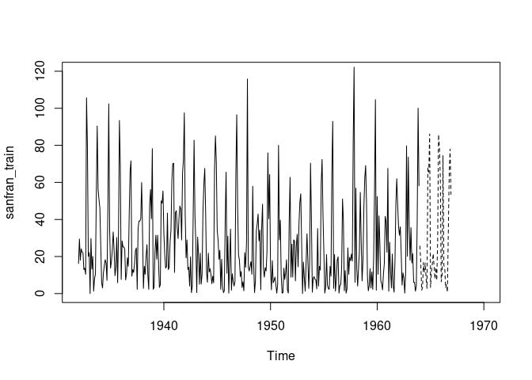
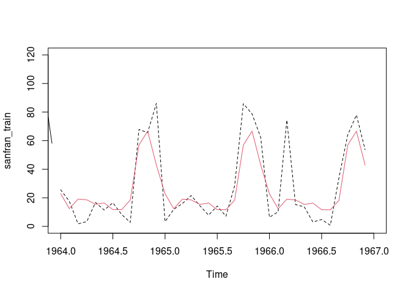
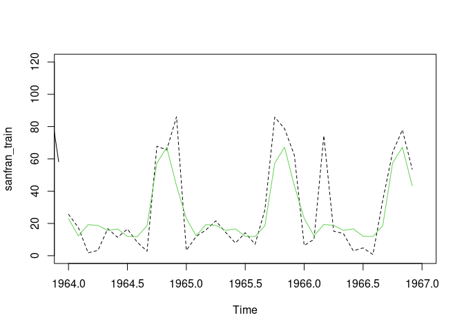
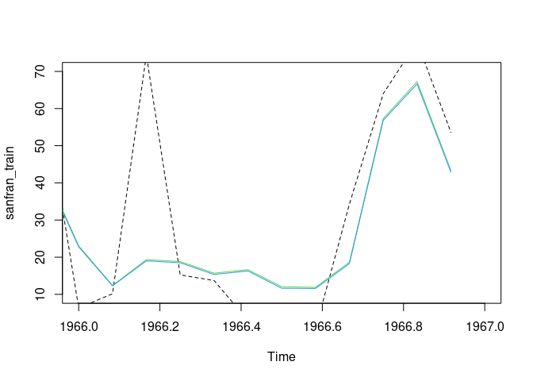
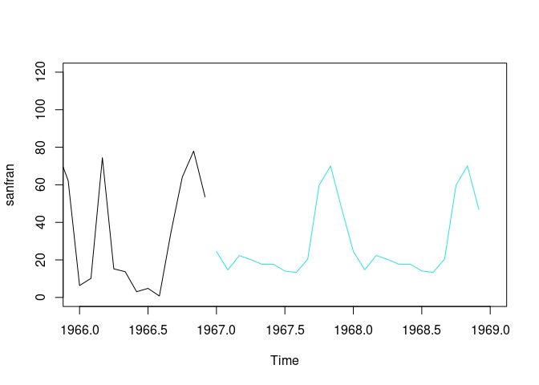

TS - San Francisco Precipitations
================
Benjamin BERNARD
28/10/2021

On this page we’ll forecast precipitations for the city of San
Francisco.

1.  **Dataset splitting**

Let’s download and split the dataset into train and test sets :

``` r
data=scan(file="http://eric.univ-lyon2.fr/~jjacques/Download/DataSet/sanfran.dat",skip=1)
sanfran<-ts(data,start=c(1932,1),end=c(1966,12),freq=12)
library(forecast)
```

    ## Registered S3 method overwritten by 'quantmod':
    ##   method            from
    ##   as.zoo.data.frame zoo

``` r
sanfran_train=window(sanfran,,start=c(1932,1),end=c(1963,12))
sanfran_test=window(sanfran,,start=c(1964,1),end=c(1966,12))
```

2.  **Data study and Model configuration**

Now we can visualize both subsets

``` r
plot(sanfran_train,xlim=c(1932,1970),ylim=c(0,120))
lines(sanfran_test,lty=2)
```

<!-- -->

Looks like we have a seasonal pattern here.

Let’s create a model and try it on the test set :

``` r
library(forecast)
h=hw(sanfran_train,damped=FALSE,h=36)
plot(sanfran_train,xlim=c(1964,1967),ylim=c(0,120))
lines(sanfran_test,lty=2)
lines(h$mean,col=2)
```

<!-- -->

``` r
print(sqrt(mean((h$mean-sanfran_test)^2)))
```

    ## [1] 15.86614

``` r
accuracy(h,sanfran_test)
```

    ##                     ME     RMSE      MAE       MPE     MAPE      MASE
    ## Training set 0.1756343 15.99891 12.17829      -Inf      Inf 0.7695343
    ## Test set     2.6628745 15.86614 10.93715 -131.3524 156.7797 0.6911073
    ##                     ACF1 Theil's U
    ## Training set -0.01949954        NA
    ## Test set     -0.06479726 0.4754544

``` r
h
```

    ##          Point Forecast     Lo 80    Hi 80      Lo 95    Hi 95
    ## Jan 1964       22.86451  1.920100 43.80892  -9.167201 54.89622
    ## Feb 1964       12.39115 -8.564556 33.34686 -19.657837 44.44014
    ## Mar 1964       19.10692 -1.860146 40.07398 -12.959440 51.17328
    ## Apr 1964       18.58340 -2.395082 39.56189 -13.500422 50.66723
    ## May 1964       15.44387 -5.546103 36.43384 -16.657522 47.54526
    ## Jun 1964       16.38884 -4.612679 37.39036 -15.730211 48.50789
    ## Jul 1964       11.72802 -9.285108 32.74115 -20.408786 43.86483
    ## Aug 1964       11.67983 -9.344971 32.70463 -20.474830 43.83449
    ## Sep 1964       18.37581 -2.660732 39.41235 -13.796804 50.54842
    ## Oct 1964       56.92777 35.879431 77.97611  24.737112 89.11843
    ## Nov 1964       66.70537 45.645165 87.76558  34.496566 98.91418
    ## Dec 1964       42.94284 21.870703 64.01497  10.715789 75.16988
    ## Jan 1965       22.82261  1.738412 43.90680  -9.422887 55.06810
    ## Feb 1965       12.34925 -8.747004 33.44550 -19.914685 44.61318
    ## Mar 1965       19.06502 -2.043355 40.17339 -13.217452 51.34748
    ## Apr 1965       18.54150 -2.579053 39.66206 -13.759600 50.84260
    ## May 1965       15.40197 -5.730838 36.53477 -16.917868 47.72180
    ## Jun 1965       16.34694 -4.798178 37.49205 -15.991726 48.68560
    ## Jul 1965       11.68612 -9.471373 32.84361 -20.671472 44.04371
    ## Aug 1965       11.63793 -9.532003 32.80786 -20.738689 44.01455
    ## Sep 1965       18.33391 -2.848532 39.51634 -14.061838 50.72965
    ## Oct 1965       56.88587 35.690862 78.08088  24.470902 89.30084
    ## Nov 1965       66.66347 45.455825 87.87111  34.229177 99.09776
    ## Dec 1965       42.90093 21.680591 64.12128  10.447220 75.35465
    ## Jan 1966       22.78071  1.547526 44.01389  -9.692641 55.25405
    ## Feb 1966       12.30735 -8.938665 33.55336 -20.185623 44.80031
    ## Mar 1966       19.02311 -2.235791 40.28202 -13.489575 51.53580
    ## Apr 1966       18.49960 -2.772265 39.77146 -14.032910 51.03211
    ## May 1966       15.36006 -5.924826 36.64495 -17.192367 47.91249
    ## Jun 1966       16.30504 -4.992945 37.60302 -16.267415 48.87749
    ## Jul 1966       11.64422 -9.666919 32.95535 -20.948353 44.23679
    ## Aug 1966       11.59603 -9.728330 32.92039 -21.016764 44.20882
    ## Sep 1966       18.29200 -3.045641 39.62965 -14.341108 50.92512
    ## Oct 1966       56.84397 35.492970 78.19497  24.190435 89.49750
    ## Nov 1966       66.62157 45.257150 87.98598  33.947511 99.29562
    ## Dec 1966       42.85903 21.481132 64.23693  10.164355 75.55371

With this model the RMSE (Root mean square error) is : 15.99891.

Obviously, we can also see if the model fits well or not just comparing
the plots.

Let’s try a damped version to see if it fits better our test set.

``` r
hd=hw(sanfran_train,damped=TRUE,h=36)
plot(sanfran_train,xlim=c(1964,1967),ylim=c(0,120))
lines(sanfran_test,lty=2)
lines(hd$mean,col=3)
```

<!-- -->

``` r
print(sqrt(mean((hd$mean-sanfran_test)^2)))
```

    ## [1] 15.77082

``` r
hd
```

    ##          Point Forecast     Lo 80    Hi 80      Lo 95    Hi 95
    ## Jan 1964       23.00394  2.050941 43.95694  -9.040907 55.04879
    ## Feb 1964       12.28948 -8.672068 33.25102 -19.768439 44.34739
    ## Mar 1964       19.28124 -1.688900 40.25138 -12.789823 51.35231
    ## Apr 1964       18.75531 -2.223477 39.73411 -13.328978 50.83961
    ## May 1964       15.63975 -5.347741 36.62724 -16.457847 47.73735
    ## Jun 1964       16.57486 -4.421375 37.57110 -15.536112 48.68584
    ## Jul 1964       11.99790 -9.007136 33.00293 -20.126530 44.12233
    ## Aug 1964       11.82202 -9.191858 32.83589 -20.315932 43.95997
    ## Sep 1964       18.61834 -2.404425 39.64110 -13.533204 50.76988
    ## Oct 1964       57.24870 36.217007 78.28040  25.083501 89.41390
    ## Nov 1964       67.19212 46.151455 88.23279  35.013198 99.37105
    ## Dec 1964       43.31452 22.264839 64.36420  11.121811 75.50723
    ## Jan 1965       23.05098  1.992178 44.10978  -9.155678 55.25764
    ## Feb 1965       12.33522 -8.732673 33.40312 -19.885344 44.55579
    ## Mar 1965       19.32573 -1.751297 40.40276 -12.908801 51.56026
    ## Apr 1965       18.79858 -2.287616 39.88478 -13.449973 51.04713
    ## May 1965       15.68183 -5.413573 36.77723 -16.580803 47.94445
    ## Jun 1965       16.61578 -4.488854 37.72042 -15.660974 48.89254
    ## Jul 1965       12.03769 -9.076215 33.15160 -20.253244 44.32863
    ## Aug 1965       11.86072 -9.262493 32.98393 -20.444446 44.16589
    ## Sep 1965       18.65598 -2.476572 39.78853 -13.663468 50.97542
    ## Oct 1965       57.28531 36.143390 78.42722  24.951535 89.61908
    ## Nov 1965       67.22772 46.076409 88.37903  34.879580 99.57586
    ## Dec 1965       43.34914 22.188404 64.50988  10.986587 75.71170
    ## Jan 1966       23.08465  1.914392 44.25491  -9.292465 55.46176
    ## Feb 1966       12.36797 -8.811770 33.54770 -20.023646 44.75958
    ## Mar 1966       19.35757 -1.831669 40.54682 -13.048576 51.76373
    ## Apr 1966       18.82955 -2.369225 40.02832 -13.591179 51.25028
    ## May 1966       15.71194 -5.496386 36.92028 -16.723398 48.14729
    ## Jun 1966       16.64507 -4.572835 37.86299 -15.804919 49.09507
    ## Jul 1966       12.06618 -9.161333 33.29369 -20.398500 44.53086
    ## Aug 1966       11.88842 -9.348714 33.12556 -20.590975 44.36782
    ## Sep 1966       18.68292 -2.563865 39.92970 -13.811233 51.17707
    ## Oct 1966       57.31151 36.055056 78.56796  24.802570 89.82045
    ## Nov 1966       67.25320 45.987064 88.51934  34.729450 99.77696
    ## Dec 1966       43.37392 22.098078 64.64977  10.835325 75.91252

We can see that the RMSE is slightly better. So we’ll use this damped
version to forecast unknown precipitations values.

Let’s see that adding both models to the same plot :

``` r
plot(sanfran_train,xlim=c(1966,1967),ylim=c(10,70))
lines(sanfran_test,lty=2)
lines(hd$mean,col=3)
lines(h$mean,col=4)
```

<!-- -->

Not easy to see any difference between damped and undamped version.
Hopefully we may compute the RMSE to compare both and find the best
model.

3.  **Forecast**

Now we’ll try to forecast the values after 1967, where our dataset
stops.

``` r
hf=hw(sanfran,seasonal='additive',damped=TRUE, h=24)
plot (sanfran,xlim=c(1966,1969),ylim=c(0,120))+lines(hf$mean, col=5)
```

<!-- -->

    ## integer(0)
