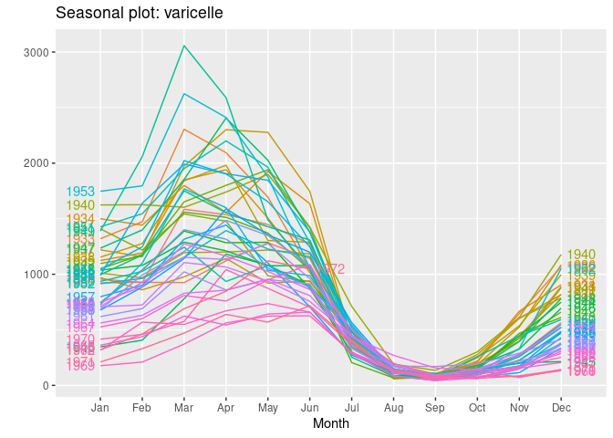

TS - Varicella Forecast
================
Benjamin BERNARD
28/10/2021

First we start to load necessary packages and dateset

``` r
library(forecast)
```

    ## Registered S3 method overwritten by 'quantmod':
    ##   method            from
    ##   as.zoo.data.frame zoo

``` r
library(ggplot2)
data=read.csv(file="http://eric.univ-lyon2.fr/~jjacques/Download/DataSet/varicelle.csv")
varicelle<-ts(data$x,start=c(1931,1),end=c(1972,6),freq=12)
plot(varicelle)
```

<!-- -->

1\. **Data Manipulation**

This is the first step to understand the dataset we have.

When looking to the plot, data looks seasonal. Seasonal means that there
is a correlation between the time and the value to analyse. In other
words, same even happen at the same period.

To visualise that we can plot a correlogram :

``` r
tmp=acf(varicelle, type="cor", plot=TRUE)
```

<!-- -->

``` r
ptmp=pacf(varicelle, type="cor", plot=FALSE)
plot (ptmp)
```

<!-- -->

Correlogram shows the correlations. There are significant when it goes
above or below the blue dotted line. As the correlations are periodic
here (looks that the ACF is sinusoidal) we can conclude that the data
are correlated on a cyclic pattern and so are seasonal.

``` r
ggseasonplot(varicelle,year.labels= TRUE,year.labels.left=TRUE)
```

<!-- -->

The seasonal plot above confirm the seasonality : we can easily see a
peak February and April and a dramatic decreasing with a minimum value
in September.

By computing the values year per year we can see better that on top of
the seasonality we have a decreasing trend : varicella number of cases
is decreasing over the time.

``` r
x=rep(0,41)
for (i in 0:40) x[i+1]<-sum(varicelle[(1+12*i):(12*(i+1))])
plot(x,type='l',xaxt='n',xlab='')
axis(1,at = 0:40,labels = 1931:1971)
```

<!-- -->

2.  **Forecasting**

As usual we split the time series in test and train subsets :

``` r
serie_train=window(varicelle,start=c(1931,1),end=c(1970,12))
serie_test=window(varicelle,start=c(1971,1),end=c(1972,6))
```

How to choose the size of the test set ? It should be the same size than
the period you want to forecast : if you want to forecast 10 years, then
your test set must be 10 years long.

Now we’ll try several forecast models and find the best one :

**Holt Winters exponential smoothing Model**

``` r
fithw=hw(serie_train,lambda="auto")
prevhw=forecast(fithw,h=18)
autoplot(prevhw, xlim=c(1965,1972.6),ylim=c(0,2500)) + autolayer(serie_test, series="true data")+
autolayer(prevhw$mean, series="HW forecasts")
```

    ## Scale for 'x' is already present. Adding another scale for 'x', which will
    ## replace the existing scale.

    ## Warning: Removed 408 row(s) containing missing values (geom_path).

<!-- -->

**Automatic SARIMA Model**

The parameters of this model are defined automatically by the function.

``` r
fitasm=auto.arima(serie_train,lambda="auto")
prevasm=forecast(fitasm,h=18)
autoplot(prevasm,xlim=c(1965,1972.6),ylim=c(0,2500)) + autolayer(serie_test, series="true data")+
autolayer(prevasm$mean, series="Auto SARIMA forecasts")
```

    ## Scale for 'x' is already present. Adding another scale for 'x', which will
    ## replace the existing scale.

    ## Warning: Removed 408 row(s) containing missing values (geom_path).

<!-- -->

System choose an ARIMA(1,0,0)(1,1,1)\[12\] model. We’ll compare it later
with the other model tried.

**Auto-regressive Neural Network**

Now we’ll use a deep learning model.

``` r
fitnn=nnetar(serie_train,lambda = "auto")
prevnn=forecast(fitnn,h=18)
autoplot(prevnn,xlim=c(1965,1972.6),ylim=c(0,2500)) + autolayer(serie_test, series="true data")+
autolayer(prevnn$mean, series="Neural Network Forecast")
```

    ## Scale for 'x' is already present. Adding another scale for 'x', which will
    ## replace the existing scale.

    ## Warning: Removed 408 row(s) containing missing values (geom_path).

<!-- -->

**Forecasting models comparison**

``` r
cat('RMSE Hot Winters :',sqrt(mean((serie_test-prevhw$mean)^2)),'\n')
```

    ## RMSE Hot Winters : 203.0989

``` r
cat('RMSE Automatic SARIMA:',sqrt(mean((serie_test-prevasm$mean)^2)),'\n')
```

    ## RMSE Automatic SARIMA: 142.2667

``` r
cat('RMSE Neural Network:',sqrt(mean((serie_test-prevnn$mean)^2)),'\n')
```

    ## RMSE Neural Network: 271.4852

We have a winner : Automatic SARIMA Model ! But this can be improved.

3.  **Model improvement**
